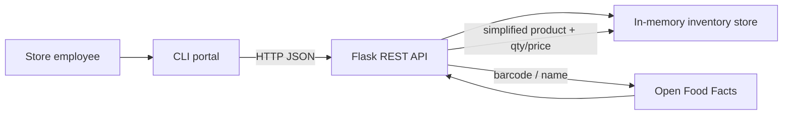

# Retail Inventory Portal

A Flask REST API and command-line administrator portal for a small grocery retailer. Employees can stock products, adjust prices, and pull real product facts from [Open Food Facts](https://openfoodfacts.github.io/openfoodfacts-server/api/) instead of typing every label by hand.

This project is built as a **portfolio piece**: clear architecture, real HTTP clients, mocked tests, and an honest in-memory store rather than a fake database pretending to be Postgres.

## What it does

- Full **CRUD** for inventory items (`GET`, `POST`, `PATCH`, `DELETE`)
- **Helper routes**: health check, low-stock report, barcode lookup, name search, import-from-catalog
- **Open Food Facts** integration by barcode or product name
- A **CLI menu** that talks to the API over HTTP (it never mutates the store directly)
- **pytest** coverage for storage, routes, the catalog client, and the CLI — Open Food Facts is always mocked

## Architecture



Two catalogs, two jobs:

| System | Owns |
| --- | --- |
| **This API** | Stock on the shelf: `id`, `quantity`, `price` |
| **Open Food Facts** | Product facts: name, brand, ingredients, package size, Nutri-Score |

`package_size` from Open Food Facts is `"400 g"`. `quantity` is how many units you have. Mixing those up is a common API-design mistake; this codebase keeps them separate.

Storage is a Python structure in memory (the lab's "database array"). Restarting Flask restores the three seed items and drops anything you added. That is intentional and documented — persistence is the obvious next step, not a hidden gap.

## Project layout

```
app/
  __init__.py          Application factory
  config.py            Environment-driven settings
  models.py            InventoryItem dataclass
  storage.py           In-memory store + seed catalog
  validation.py        POST/PATCH rules
  openfoodfacts.py     External API client
  deps.py              Flask accessors
  blueprints/
    health.py          GET /  GET /health
    inventory.py       CRUD + low-stock
    catalog.py         Lookup, search, import
cli.py                 Administrator menu
run.py                 Flask entrypoint
tests/                 pytest suite
```

## Setup

Python 3.10+ recommended.

```bash
cd Inventory-Management-System
python3 -m venv .venv
source .venv/bin/activate
pip install -r requirements.txt
```

Optional: copy `.env.example` and export `OFF_USER_AGENT` so Open Food Facts can identify your app.

## Run the API

```bash
python run.py
```

The server listens on `http://127.0.0.1:5000` with three seed products (Silk almond milk, Nutella, Coca-Cola).

Sanity check:

```bash
curl http://127.0.0.1:5000/health
curl http://127.0.0.1:5000/inventory
```

## Run the CLI

Keep Flask running, then in a **second terminal** (same venv):

```bash
python cli.py
```

Menu:

1. View all inventory
2. View item by ID
3. Add item manually
4. Update price or stock
5. Delete item
6. Find on Open Food Facts (optionally import into inventory)
7. Low-stock report
0. Exit

Option 6 is the showcase flow: look up a real barcode (Nutella is `3017620422003`) or search `almond milk`, then choose quantity and price. The CLI calls `POST /inventory/import`, which hits Open Food Facts and appends a row to the store.

If Flask is not running, the CLI says so instead of dumping a stack trace.

## API reference

Successful list responses use `{ "count", "items" }`. Single resources return the item object. Errors return `{ "error": "..." }` with the appropriate status code.

| Method | Path | Purpose |
| --- | --- | --- |
| `GET` | `/` | Route index |
| `GET` | `/health` | Liveness + current item count |
| `GET` | `/inventory` | All items |
| `GET` | `/inventory/<id>` | One item |
| `POST` | `/inventory` | Create (manual) |
| `PATCH` | `/inventory/<id>` | Partial update (price/qty) |
| `DELETE` | `/inventory/<id>` | Remove |
| `GET` | `/inventory/low-stock?threshold=5` | Helper: items at or below threshold |
| `GET` | `/products/barcode/<barcode>` | Helper: Open Food Facts by barcode |
| `GET` | `/products/search?q=nutella` | Helper: Open Food Facts by name |
| `POST` | `/inventory/import` | Helper: fetch by barcode **and** add to inventory |

### Create

```bash
curl -X POST http://127.0.0.1:5000/inventory \
  -H "Content-Type: application/json" \
  -d '{"name":"Oat Milk","brand":"Oatly","quantity":12,"price":3.99}'
```

### Update stock

```bash
curl -X PATCH http://127.0.0.1:5000/inventory/1 \
  -H "Content-Type: application/json" \
  -d '{"quantity":2}'
```

### Import from Open Food Facts

```bash
curl -X POST http://127.0.0.1:5000/inventory/import \
  -H "Content-Type: application/json" \
  -d '{"barcode":"3017620422003","quantity":8,"price":4.99}'
```

Status codes worth knowing:

- `201` created
- `400` validation (missing name, negative price, empty PATCH)
- `404` unknown id or unknown barcode
- `409` that barcode is already in inventory
- `502` Open Food Facts timed out or was unreachable

## Tests

```bash
pytest
```

The suite does **not** call the live Open Food Facts network. `unittest.mock` and a `FakeOFFClient` stand in so tests stay fast and deterministic. That is the same pattern you would use around any third-party API at work.

## Design choices (interview talking points)

1. **Application factory** — tests inject an empty store and a fake catalog; `python run.py` still seeds demo data.
2. **CLI is a client** — if you can stock items with Flask down, the layering is wrong. Here you cannot.
3. **Simplify at the boundary** — `simplify_product()` is the only function that knows Open Food Facts' JSON shape. Name search uses the CGI endpoint, then falls back to Search-a-licious if that service returns 5xx.
4. **Duplicate barcodes are conflicts, not silent duplicates** — a second Nutella import returns `409`.
5. **Booleans are not integers** — `quantity: true` is rejected because `bool` subclasses `int` in Python.
6. **Helper routes** sit next to CRUD so the API is usable from curl without the CLI: health, low-stock, lookup, search, import.

## What I would add next

- SQLite or Postgres so stock survives a restart
- Auth (employees vs. managers)
- Idempotent imports and a received-shipment endpoint
- A small React admin instead of (or besides) the CLI

## License

Course / portfolio project. Open Food Facts data is contributed by its community; respect their [API terms](https://openfoodfacts.github.io/openfoodfacts-server/api/) (identify your User-Agent, do not hammer the service).
